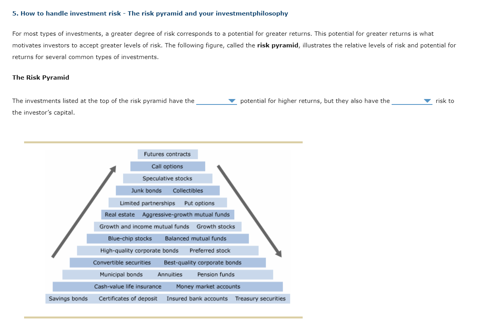
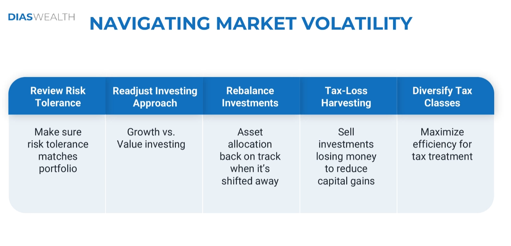

# Risk

## INFLATION RISK

### What is inflation risk?

Inflation will undermine the performance of an investment and/or the future
purchasing power.

### How to avoid inflation risk?

Diversification into multiple asset classes should help reduce inflation risk.

## Compound Interest Rate Risk

### What is interest rate risk?

Chance that bond prices overall will decline due to rising interest rates.

### How to avoid interest rate risk?

Depending on the time period, investing in either short, mid, or long-term bonds might help avoid interest rate risk. Also, using annuities can reduce the risk associated with bonds.

## LEGISLATIVE RISK

### What is legislative risk?

Legislative changes or court rulings may impact the value of investments.

### How to avoid legislative risk?

Diversification into multiple asset classes should help reduce legislative risk.

## Volatile Market Periods?

### The market can stay irrational longer than you can stay solvent.

The saying is: "The market can stay irrational longer than you can stay solvent." It's often attributed to economist John Maynard Keynes.

This quote is a reminder to investors that financial markets can be unpredictable and sometimes illogical in the short term. Even if an asset's price seems unsustainably high, it could keep going up for a while. Investors who bet against the market by shorting it (borrowing shares to sell them, hoping to buy them back later at a lower price) risk running out of money before the market corrects itself.

Here's a breakdown of the saying's meaning:

- **The market can stay irrational:** Financial markets aren't always driven by logic or fundamentals like a company's profitability. They can be influenced by emotions, speculation, and even fads. This can lead to periods where asset prices become inflated (bubbles) or fall more than what seems justified.
- **Longer than you can stay solvent:** Investors need to have enough money to cover their losses if their bets go wrong. If they're constantly trying to fight the market by shorting assets that keep going up, they could exhaust their funds before the market eventually corrects.

In short, the saying is a cautionary tale for investors. It emphasizes the importance of having a well-defined investment strategy, managing risk, and avoiding getting caught up in the euphoria or fear that can grip markets from time to time.

## Sequence of Returns Risk

Sequence of Returns Risk refers to the threat that the timing of investment returns can significantly impact the overall effectiveness of an investment strategy, particularly during retirement or when withdrawing funds from a portfolio. It arises when the sequence of positive and negative returns affects the sustainability of a portfolio's value over time.

In other words, SORR occurs when:

1. A portfolio experiences a significant decline in value early in retirement (or when withdrawals begin).
2. The portfolio's recovery from this decline is slow or incomplete.
3. The investor is forced to withdraw funds from the declining portfolio, perpetuating the loss.

This risk is particularly pronounced in retirement, as investors typically rely on their portfolios for income and may not have the luxury of time to recover from market downturns.

**Key Factors Contributing to SORR:**

1. **Market volatility**: Frequent and significant market fluctuations can increase the likelihood of SORR.
2. **Withdrawal rates**: Higher withdrawal rates can exacerbate the impact of SORR, as they reduce the portfolio's ability to recover from market downturns.
3. **Portfolio composition**: Portfolios with higher equity exposure are more susceptible to SORR, as stock market declines can have a greater impact on overall value.
4. **Retirement duration**: Longer retirement periods increase the likelihood of SORR, as investors may face multiple market downturns and recovery periods.

**Mitigating SORR Strategies:**

1. **Rebalancing**: Regularly adjusting portfolio allocations to maintain target risk levels and minimize exposure to market fluctuations.
2. **Bucketing**: Segmenting retirement savings into separate accounts with different investment strategies and withdrawal rates to minimize the impact of SORR.
3. **Dynamic spending**: Adjusting withdrawal rates based on market conditions to avoid depleting the portfolio during downturns.
4. **Fixed income**: Incorporating fixed-income investments to provide a stable source of income and reduce reliance on equities during market downturns.
5. **Longevity insurance**: Considering annuity products or other guaranteed income solutions to provide a predictable income stream and protect against SORR.

By understanding Sequence of Returns Risk and implementing strategies to mitigate its impact, investors can better navigate the challenges of retirement and ensure a more sustainable income stream over time.

