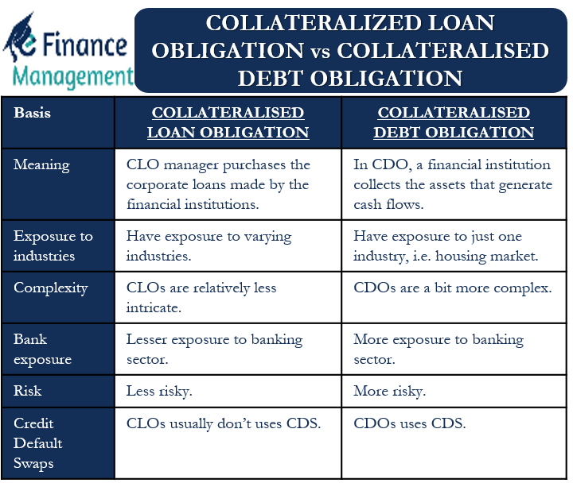

# Securities

## Short Term Liquid Securities

Short-term liquid securities are financial instruments that are highly liquid and have a short maturity period, typically less than one year. These securities are easily convertible into cash and are considered to have minimal risk of value fluctuations. They are commonly used by individuals and organizations to preserve capital, maintain liquidity, and earn some level of return in the short term.

Examples of short-term liquid securities include:

1. Treasury Bills (T-Bills): These are short-term debt instruments issued by governments to raise funds. They typically have maturities ranging from a few days to one year.
2. Commercial Paper: Commercial paper represents short-term unsecured promissory notes issued by corporations to meet their immediate financing needs. They are typically issued for periods ranging from a few days to nine months.
3. Certificates of Deposit (CDs): CDs are time deposits offered by banks and financial institutions. They have fixed terms ranging from a few weeks to several months or even a year, and they offer a fixed interest rate.
4. Money Market Instruments: Money market instruments include Treasury bills, commercial paper, repurchase agreements, and short-term municipal, corporate, or government bonds. These are traded in the money market, which is a segment of the financial market focused on short-term borrowing and lending.
5. Banker's Acceptance: A banker's acceptance is a time draft drawn on and accepted by a bank. It represents a short-term promise of payment and is often used in international trade transactions.

These short-term liquid securities are generally considered to be safe investments because they have low default risk and high liquidity. However, the returns on these investments are typically lower compared to longer-term securities or riskier investments.

## government-backed securities

1. Government National Mortgage Association (GNMA or Ginnie Mae) Securities: These are mortgage-backed securities issued by the Government National Mortgage Association, a government-owned corporation within the U.S. Department of Housing and Urban Development. Ginnie Mae securities are backed by the full faith and credit of the U.S. government and are considered to be among the safest types of mortgage-backed securities.
2. Farm Credit System (FCS) Securities: These are debt securities issued by the Farm Credit System, a network of borrower-owned lending institutions that provide credit to farmers, ranchers, and other agricultural borrowers. FCS securities are backed by the system's assets and the full faith and credit of the U.S. government.
3. Small Business Administration (SBA) Securities: These are securities issued by the Small Business Administration, a government agency that provides loans and other assistance to small businesses. SBA securities are backed by the full faith and credit of the U.S. government.
4. Federal National Mortgage Association (FNMA or Fannie Mae) and Federal Home Loan Mortgage Corporation (FHLMC or Freddie Mac) Securities: These are mortgage-backed securities issued by Fannie Mae and Freddie Mac, respectively. While these entities are not directly backed by the government, they are government-sponsored enterprises (GSEs) that receive implicit government backing.

## defensive stocks that have less volatility

Defensive stocks are stocks of companies that are considered less sensitive to economic cycles and are expected to perform relatively well even during market downturns. These stocks tend to have less volatility compared to the overall market.

Some examples of defensive stocks include:

1. Consumer staples: These are companies that produce essential items such as food, beverages, household products, and personal care items that people need regardless of the state of the economy. Examples of consumer staples companies include Procter & Gamble, Coca-Cola, and Walmart.
2. Utilities: These are companies that provide essential services such as electricity, gas, and water. They tend to have stable earnings and cash flows, which make them less volatile. Examples of utility companies include Duke Energy, Exelon, and Southern Company.
3. Healthcare: These are companies that provide healthcare products and services such as pharmaceuticals, medical devices, and healthcare facilities. The healthcare sector is generally considered defensive because people always need healthcare regardless of economic conditions. Examples of healthcare companies include Johnson & Johnson, Pfizer, and UnitedHealth Group.
4. Telecom: These are companies that provide communication services such as telephone, internet, and television. They tend to have stable earnings and cash flows, which make them less volatile. Examples of telecom companies include AT&T, Verizon, and Comcast.

It's important to note that while these stocks tend to have less volatility, they are not immune to market fluctuations and can still be affected by broader economic conditions and market trends.

## fixed-income securities

Bonds are debt securities issued by corporations or government entities to raise capital. When an investor buys a bond, they are essentially lending money to the issuer in exchange for regular interest payments and the return of their principal investment at the end of the bond's term. Bonds typically have longer maturities than Treasury bills and CDs, ranging from a few years to several decades. Bonds also come in different varieties, such as corporate bonds, municipal bonds, and government bonds.

Treasury bills, also known as T-bills, are short-term debt securities issued by the U.S. government. T-bills are issued with maturities ranging from a few days to 52 weeks, and they are sold at a discount to their face value. When the T-bill matures, the investor receives the face value of the security. Because T-bills are backed by the full faith and credit of the U.S. government, they are considered to be one of the safest investments available.

Certificates of Deposit (CDs) are time deposits offered by banks and other financial institutions. When an investor buys a CD, they agree to deposit a fixed amount of money for a fixed period of time, ranging from a few months to several years. In exchange for their investment, the investor receives a fixed rate of interest for the term of the CD. CDs are insured by the Federal Deposit Insurance Corporation (FDIC) up to $250,000 per depositor, per insured bank, making them a relatively safe investment.

In summary, bonds, Treasury bills, and CDs are all fixed-income securities that offer different levels of risk and return. Bonds offer higher yields but carry more risk than T-bills and CDs. T-bills are very low-risk but offer lower returns than bonds and CDs. CDs are also low-risk and offer higher yields than T-bills but lower yields than bonds. The choice of which type of security to invest in depends on the investor's risk tolerance, investment objectives, and time horizon.

## private vs govt

Government-backed securities are securities that are issued or guaranteed by a government agency or sponsored entity, while private securities are issued by private companies or corporations. Here are some key differences between government-backed and private securities:

1. Risk: Government-backed securities are generally considered to be less risky than private securities. This is because government-backed securities are backed by the full faith and credit of the government, which means that the government has the ability to raise taxes or print money to repay its debts. Private securities, on the other hand, are not backed by the government and are subject to the credit risk of the issuing company.
2. Yield: Government-backed securities generally offer lower yields than private securities. This is because they are considered to be less risky, and investors are willing to accept a lower return in exchange for the safety of their investment.
3. Liquidity: Government-backed securities are generally more liquid than private securities. This is because they are widely traded in the market and are often used as a benchmark for other types of securities. Private securities, on the other hand, may be less liquid and may be more difficult to sell in the market.
4. Availability: Government-backed securities are more widely available than private securities. This is because they are issued by government agencies and sponsored entities that are established to facilitate the financing of government programs. Private securities, on the other hand, are issued by private companies and may not be available to all investors.
5. Regulation: Government-backed securities are subject to more stringent regulation than private securities. This is because they are issued by government agencies and sponsored entities that are subject to oversight by federal regulators. Private securities, on the other hand, may be subject to less regulation and may be riskier as a result.

In summary, government-backed securities are generally considered to be less risky and more liquid than private securities, but they also offer lower yields. Private securities may offer higher returns, but they are subject to greater credit risk and may be less liquid. The choice between government-backed and private securities depends on the investor's risk tolerance, investment objectives, and individual circumstances.

### Gov't Backed Securities

## Equity securities, also known as stocks or shares

represent ownership in a company and give the holder the right to vote on certain matters and receive a portion of the company's profits in the form of dividends. The value of equity securities can fluctuate based on various factors such as the company's financial performance, industry trends, and overall market conditions.

## Debt securities

on the other hand, represent a loan made by an investor to a company or government entity, and include bonds, notes, and other similar instruments. Debt securities typically offer a fixed rate of return, and their value can also be affected by various factors such as interest rates, creditworthiness of the issuer, and overall market conditions.
