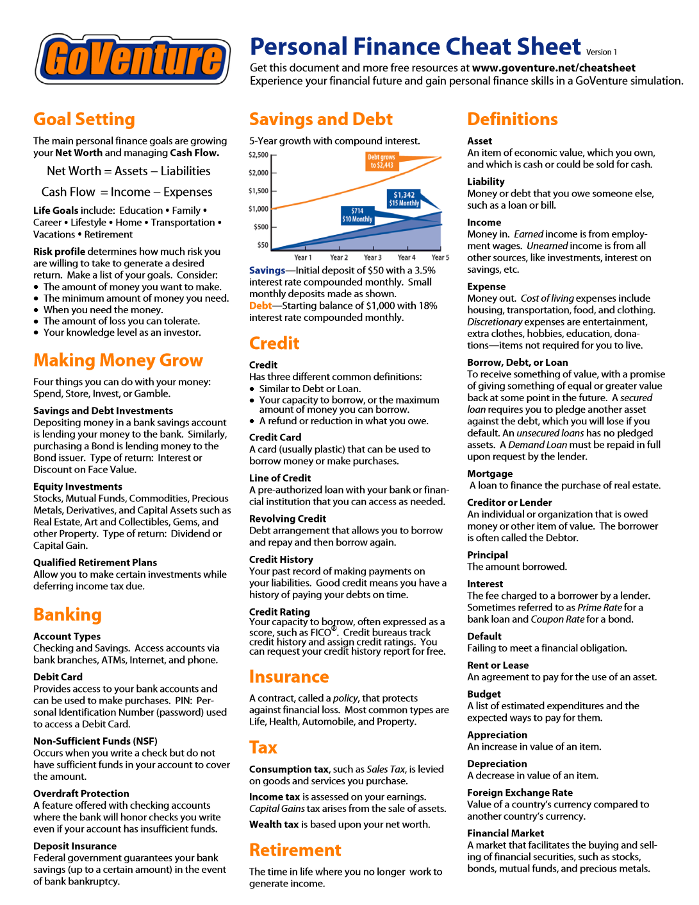

# Personal Finance

## Dave Ramsey’s 7 Baby Steps

No financial strategy roundup would be complete without mention of Dave Ramsey. Love or hate him, his reach and influence as a best-selling author and radio show host can’t be denied. Here are Ramsey’s “7 Baby Steps” to living debt-free:

1. Save $1,000 for a starter emergency fund.

1. Pay off debt (except your house) using Ramsey’s controversial “

[Snowball Method](https://www.debt.org/advice/debt-snowball-method-how-it-works/ "‌")” of attacking the smallest debts first (regardless of interest rates on larger debt amounts).

1. Build out your starter emergency fund with enough to pay for 3 to 6 months worth of expenses.

1. Invest 15% of your income in your employer’s 401(k) plan and Roth IRAs.

1. Save “as much as possible” for your child’s college, in Educational Savings Accounts (ESAs) and 529 tax-advantaged savings plans.

1. Pay off your mortgage.

1. Build wealth and donate.

## Bogleheads

Named after Vanguard Group founder John Bogle, this strategy advocates for saving at least 20% of your income, investing early and often, never trying to “time the market,” finding a risk profile that is not too high _or_ too low, investing in broadly diversified low-cost (low expense ratio) index funds, and staying the course through the stock market’s ups and downs (i.e., not selling the minute you smell a bear market).

In his speech “[Investing with Simplicity](http://johncbogle.com/wordpress/wp-content/uploads/2019/08/Investing-with-Simplicity-1-30-99.pdf "‌")” Bogle said, “Simplicity is the master key to financial success.” Rather than doing extensive research on and tracking of individual stocks, advocate achieving portfolio diversification by following a simple investing philosophy: the creation of a three-fund “lazy” portfolio that includes a total stock market index fund, a total international stock index fund, and a total bond market fund (a percentage that Bogle recommends should be equivalent to your age—if you’re 40, allocate 40% of your portfolio to bonds). Then, outside of periodic rebalancing, set it, forget it, and watch your money produce returns with the market over time.

## it is important to remember that no investment is without risk!

## 5 Level Risk Pyramid

## Personal Finance Terms and Strategies

1. **Zero-Based Budgeting:**
   * A budgeting method where every dollar is allocated to specific expenses, savings, or debt repayment, leaving a balance of zero. This approach ensures that you are intentional with your spending.

2. **50/30/20 Rule:**
   * A simple budgeting guideline that suggests allocating 50% of your income to needs, 30% to wants, and 20% to savings or debt repayment. This balance can promote financial stability and happiness.

3. **Emergency Fund:**
   * A savings fund set aside for unexpected expenses. Having an emergency fund can provide peace of mind and reduce stress during financial uncertainties.

4. **Mindful Spending:**
   * Being conscious of your spending habits and making intentional choices about purchases. This practice encourages spending on things that genuinely bring joy and satisfaction.

5. **Cash Envelopes:**
   * A physical budgeting method where cash is allocated to different spending categories (e.g., groceries, entertainment) in separate envelopes. Once the cash is gone, no more spending occurs in that category.

6. **Sinking Funds:**
   * Savings set aside for specific future expenses (e.g., vacations, holidays, car repairs). This strategy helps avoid financial stress when these expenses arise.

7. **Needs vs. Wants Analysis:**
   * A practice of distinguishing between essential expenses (needs) and discretionary spending (wants). This clarity can help prioritize spending and enhance satisfaction.

8. **Spending Freeze:**
   * A temporary halt on non-essential spending to focus on saving or paying down debt. This can create a sense of financial control and relief.

9. **Gratitude Journaling:**
   * Keeping a journal to note things you are thankful for, particularly related to your finances. This practice can enhance happiness and perspective on what you have versus what you want.

10. **Value-Based Spending:**
    * Aligning your spending with your personal values and priorities. This approach fosters a sense of fulfillment by ensuring that your money goes towards what truly matters to you.

### Summary

Implementing these personal finance strategies can help create a healthier relationship with money, reduce financial stress, and enhance overall happiness in daily life. By focusing on intentional budgeting and mindful spending, you can achieve greater peace of mind and satisfaction with your financial decisions.

## Risk

**Risk tolerance**: the willingness to take risk
**Risk capacity**: the ability to take risk
**Risk required**: the level of risk required to meet a particular goal

## There's a lot of truth to the statement "you can't budget your way out of poverty." Here's why

* **Limited resources:**  When your income barely covers basic needs like food and rent, there's little room for budgeting to create a significant surplus. Cutting corners can only go so far.
* **Systemic factors:** Poverty often goes hand-in-hand with low wages, lack of access to education or healthcare, and discrimination. Budgeting can't fix these underlying issues.
* **Unexpected costs:**  Life throws curveballs. Even a small car repair or medical bill can derail a tight budget for someone in poverty.

However, budgeting isn't entirely useless. It can help:

* **Gain control:**  Understanding where your money goes empowers you to make informed choices, even with limited resources.
* **Stretch your income:**  Finding ways to save on groceries, transportation, or utilities can free up a little extra cash.
* **Build financial literacy:**  Budgeting is a skill that can benefit you throughout your life, even if it doesn't solve poverty on its own.

So, it's more accurate to say that budgeting alone can't eradicate poverty. But it can be a helpful tool alongside efforts to address the root causes of poverty, like job training, affordable housing initiatives, and a living wage.  

