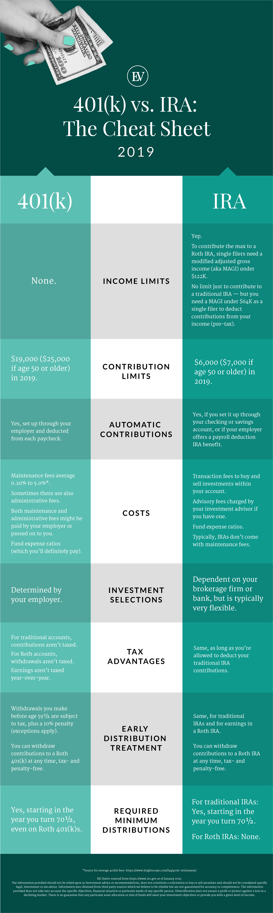

# 401k

## 401k vs Roth IRA

A traditional 401(k) can be advantageous over a Roth IRA in several situations:

* **Tax Deductibility in the Current Year**: Contributions to a traditional 401(k) are made pre-tax, which can lower your current taxable income. This can result in a tax deduction for the year of contribution, which can be beneficial if you are in a higher tax bracket now compared to when you retire.

* **Immediate Tax Savings**: If you are in a higher tax bracket now and expect to be in a lower tax bracket during retirement, the traditional 401(k) can provide immediate tax savings. You pay taxes on withdrawals in retirement at your then-current income tax rate, which could be lower than your current rate.

* **Higher Contribution Limits**: Traditional 401(k)s generally have higher contribution limits than Roth IRAs. For 2025, the contribution limit for a traditional 401(k) is $23,500, with an additional $1,000 catch-up contribution for those aged 50 or older. In contrast, the contribution limit for a Roth IRA is $7,000, with an additional $1,000 catch-up contribution for those aged 50 or older.

* **Employer Matching Contributions**: If your employer offers a matching contribution to your 401(k), contributing to a traditional 401(k) can maximize the benefit of these contributions. Employer contributions are made pre-tax, and you can benefit from the tax savings immediately.

* **Income Flexibility**: There are no income limits for contributing to a traditional 401(k), whereas there are income limits for contributing to a Roth IRA. If your income exceeds these limits, a traditional 401(k) may be a better option for tax-advantaged retirement savings.

These factors can make a traditional 401(k) more advantageous in certain financial situations, particularly if you are in a higher tax bracket now and expect to be in a lower one in retirement.

[401K Explained Simply for Beginners](https://www.youtube.com/watch?v=BhTTeIDZtKY)

| Age Group      | Average 401(k) Balance | Median 401(k) Balance | Savings Goal (Multiple of Income) | Recommended Contribution Rate |
|----------------|-----------------------|-----------------------|-----------------------------------|-------------------------------|
| 18 to 25       | $6,264                | $1,786                | 15-20% of earnings                | Aim beyond 7%                 |
| 25 to 34       | $37,211               | N/A                   | 1.2 times annual salary by age 30 | Around 8%                      |
| 35 to 44       | $97,020               | $36,117               | 2.6 times annual income           | N/A                           |
| 45 to 54       | $179,200              | N/A                   | 8.2 times annual income by age 60 | N/A                           |
| 55 to 64       | $256,244              | N/A                   | 10 times annual income by age 65  | N/A                           |

## 401K = “free money from work”

## **Step 1: The Magic 8-Ball of Percentages**

- **5% to 6%**: This is like the minimum entry fee to the investment party. Many employers match up to this amount, which is essentially free money. Not contributing enough to get the match is like leaving cash on the table - literally.

- **10% to 15%**: This is what many financial gurus recommend for a comfortable retirement. It's like setting your contribution level to "I hope to enjoy my retirement, not just survive it."

- **20% or More**: For the brave or those who plan on retiring to a secluded island where money grows on trees. This is the "I want to live like a king/queen in retirement" setting.

## **Step 2: Use the Retirement Calculator - Your Crystal Ball**

- Websites and apps offer retirement calculators. Plug in your age, current savings, expected retirement age, and lifestyle expectations. It’s like asking a fortune teller, but with numbers and less ambiguity.

## **Step 3: The Rule of 25**

- If you're a fan of the FIRE (Financial Independence, Retire Early) movement, there's the rule of 25. Multiply your desired annual spending in retirement by 25 to find out how much you need to save. For instance, if you want to spend $40,000 a year, aim for a $1 million nest egg. It's like figuring out how many dragon's hoards you need to conquer.

## **Step 4: Consider Your Financial Horoscope - Your Budget**

- **Current Expenses**: Review your budget as if you're an accountant for a movie star. How much can you realistically set aside after your monthly expenses?

- **Income Increases**: Plan to increase your contributions with any salary bump. It's like saving for a rainy day, but you're hoping for a storm of wealth in retirement.

## **Step 5: Employer Match - The Secret Sauce**

- **Match Maximization**: If your employer matches up to a certain percentage, contribute at least that much. Not doing so is like not showing up to a party that's throwing money at you.

## **Step 6: The Future Gazing - Inflation and Healthcare**

- Factor in inflation and future healthcare costs. They're like the dragons of finance - you know they'll be there, breathing fire on your savings.

## **Step 7: Consulting the Oracle - Financial Advisor**

- If all this seems too much like trying to read tea leaves, consult a financial advisor. They're the modern-day oracles of finance, minus the cryptic messages.

## **Step 8: The Fortune-Telling Adjustment**

- Life changes; your contribution might need to too. Revisit your contributions annually or with significant life changes. It's like adjusting your sails when the wind changes direction.

Remember, while we're having fun with metaphors, your 401(k) contributions are a serious step towards securing your future. The key is to start, even if you begin small, and increase as your financial situation allows. After all, in the game of retirement savings, every bit counts, and the earlier you start, the less you'll feel like you're playing catch-up.

## Funding life insurance with IRA distributions

Funding life insurance with IRA distributions can be a strategy to consider, but it's important to understand the pros and cons before you decide. Here's a breakdown:

**The Concept:**

- You use your required minimum distributions (RMDs) from your traditional IRA or 401(k) to pay the premiums on a life insurance policy.

**Benefits:**

- **Tax-Free Death Benefit:** The death benefit from the life insurance policy is typically paid out income tax-free to your beneficiaries. This can provide them with a significant financial windfall upon your passing.
- **Potential Wealth Replacement:**  The death benefit can help replace the retirement savings that you've used to pay the premiums. This can be particularly useful if your beneficiaries inherit a large tax burden from your IRA distributions.

**Drawbacks:**

- **Reduced Retirement Savings Growth:**  The money used to pay the premiums is no longer invested in your IRA, which means it loses the potential for tax-deferred growth within the retirement account.
- **Taxation of Distributions:**  The RMDs you withdraw from your IRA are taxable as income. This can increase your overall tax burden in retirement.
- **Limited Control for Beneficiaries:**  The death benefit payout is typically a lump sum, which your beneficiaries may not manage effectively.

**Important Considerations:**

- **Age:**  This strategy may not be suitable if you're younger than 59 ½  since early withdrawals from your IRA come with a 10% penalty.
- **Financial Needs:**  Ensure you have enough left from your RMDs to cover your living expenses after paying the premiums. Don't jeopardize your financial security in retirement.
- **Life Insurance Type:**  Consider universal or whole life policies that build cash value. This cash value can act as a source of emergency funds in the future. Term life insurance offers only a death benefit and may not be the best fit for this strategy.
- **Alternatives:** Explore other options like converting your IRA to a Roth IRA to minimize future RMD tax burdens.

## Roth Conversion

A **Roth conversion** is the process of transferring funds from a traditional retirement account, such as a Traditional IRA or 401(k), into a Roth IRA. This move has specific tax implications and benefits:

### Key Features of a Roth Conversion

1. **Tax Implications:**
   - When you convert to a Roth IRA, the amount converted is added to your taxable income for the year. You'll pay income taxes on this amount.
   - Future withdrawals from the Roth IRA, including earnings, are tax-free, provided certain conditions are met (e.g., the account must be held for at least five years and you must be at least 59½ years old).

2. **Benefits:**
   - **Tax-Free Growth:** Investments in a Roth IRA grow tax-free, which can be advantageous over time.
   - **No Required Minimum Distributions (RMDs):** Unlike traditional IRAs, Roth IRAs do not require withdrawals during the account owner's lifetime, allowing funds to grow longer.
   - **Tax Diversification:** Having both traditional and Roth accounts provides flexibility in managing taxes during retirement.

3. **Considerations:**
   - **Timing:** It's important to consider your current and projected future tax rates; converting in a year with lower income might be beneficial.
   - **Income Limits:** There are no income limits for converting to a Roth IRA, but there are limits for contributing directly to a Roth IRA.
   - **Conversion Amount:** You can convert all or part of your traditional account.

### Summary

A Roth conversion can be a strategic financial move, particularly for those anticipating higher tax rates in retirement or who want to maximize tax-free income later in life. However, it's essential to evaluate the tax implications and long-term benefits before proceeding.

## sep401k

**SEP IRA or Solo 401 (k)** Simplified Employee Pension IRAs and Solo 401 (k)s were created to allow small-business owners and self-employed individuals without access to an employer’s 401 (k) a similar way to save for retirement.
