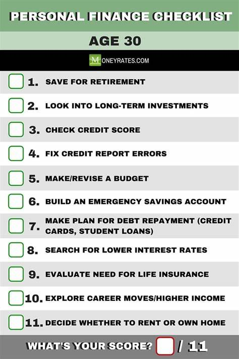

# retirement investing



- Save 10 to 15 percent of your income for retirement

## How Much Money You Need To Save By EVERY AGE

## FIRE (Financial Independence Retire Early)

You may be a candidate for this aggressive strategy if you 1) place a high priority on retiring early 2) earn a high income and 3) have the discipline to invest 50-75% of your income yearly. (Bye-bye, microbrews and Starbucks runs.) While the idea behind FIRE is not new—it first came from the 1992 book [_Your Money or Your Life_](https://yourmoneyoryourlife.com/book-summary/ "‌") by Vicki Robin and Joe Dominguez—the strategy gained popularity more recently courtesy of bloggers like Peter Adeney, the former software engineer behind [Mr. Money Mustache](https://www.mrmoneymustache.com/ "‌"), who retired at age 30.

Essentially, FIRE comes down to extreme budgeting, controlled spending, and low-cost investing—living frugally and cutting out luxuries in order to put a minimum of 50% of your income into inexpensive index funds. (Rather than the [10-15% of our pre-tax income](https://www.nerdwallet.com/article/investing/how-much-to-save-for-retirement#:~:text=When%20saving%20for%20retirement%2C%20most,replace%20more%20of%20their%20income. "‌") that experts usually recommend we put towards retirement yearly.)

Adeney wrote on his blog, however, that “Financial Independence does _not_ mean the end of your working career,” it means “complete freedom.” He also told the [Financial Times](https://www.ft.com/content/210a7877-1c43-4a8c-9d7d-6d424d474a78 "‌") that, “‘retirement’” means different things to people. For some, it could be saving enough to obtain a greater work/life balance by switching to part-time work, or choosing a career that is more rewarding but lower paid.”

While aiming for the lowest risk might seem ideal, it's important to consider growth potential alongside risk for retirement investing in your early 30s. Here's a strategy that balances both:

1. Leverage tax-advantaged accounts:

- **401(k) or similar employer plan:** Contribute at least enough to get the full employer match, basically free money.

- **IRA (Traditional or Roth):** Choose between traditional for a tax deduction now or Roth for tax-free growth and withdrawals in retirement.

1. Invest in low-cost target date funds:

- These mutual funds automatically adjust their asset allocation (mix of stocks, bonds, and cash) as you near retirement, becoming more conservative over time.

- Low-cost index funds within the target date fund minimize fees, maximizing your returns.

1. Maintain an appropriate asset allocation:

- Since you have a long time horizon (30+ years until retirement), a higher allocation towards stocks (for growth) is possible compared to someone closer to retirement.

- A common strategy is a 80/20 split, with 80% in stocks and 20% in bonds for stability. You can adjust this based on your risk tolerance.

**Remember:**

- This is a general strategy, consulting a financial advisor can personalize it for your situation.

- Rebalance your portfolio periodically to maintain your desired asset allocation.

- Stay consistent with contributions, even small amounts regularly can grow significantly over time.

Here are some resources to learn more:

- The Balance: <https://www.westernsouthern.com/investments/investing-in-your-30s>

- Investopedia: <https://www.investopedia.com/retirement-planning-4689695>

Here's how to adjust the strategy for someone in their early 30s with a high income, no prior savings, and a later retirement age:

**Increase Savings Rate:**

- **Aim Higher:** While 15% of income is a typical target, shoot for a higher savings rate, perhaps 20-25% or more. Your high income allows for aggressive saving.

- **Automatic Contributions:** Set up automatic contributions to your retirement accounts. You won't miss what you never see.

- **Lifestyle Audit:** Review your spending. Can you cut unnecessary expenses to free up more for savings?

**Catch-Up Contributions:**

- If eligible, take advantage of catch-up contributions allowed for IRAs and 401(k)s after age 50. This lets you contribute more each year to accelerate savings.

**Investment Strategy:**

- **Maintain Growth Focus:** You have a longer time horizon due to the later retirement age. A slightly higher allocation towards stocks (for growth) might be suitable compared to the 80/20 split mentioned earlier. Consider a 70/30 or 60/40 stock/bond ratio based on your risk tolerance.

- **Review Regularly:** Re-evaluate your asset allocation periodically, especially as you approach retirement. You may need to become more conservative closer to your target date.

**Additional Considerations:**

- **Pay Down Debt:** High-interest debt can hinder progress. Focus on paying off high-interest debts like credit cards before aggressively investing for retirement.

- **Employer Match:** Make sure you contribute enough to your 401(k) to get the full employer match. It's free money you don't want to leave on the table.

- **Professional Help:** Consider consulting a fee-only financial advisor specializing in high-income earners. They can create a personalized plan considering your income, risk tolerance, and retirement goals.

**Remember:**

- Starting late is better than not starting at all. The power of compound interest can still work wonders over a 20-30 year timeframe.

- Consistency is key. Make regular contributions, even if they seem small initially.

- Don't be afraid to adjust your plan as your circumstances or risk tolerance change.

## Types of Retirement Plans

- Individual retirement accounts (IRAS) traditional, Roth, and SEP IRAS.
401(k)s and other defined contribution pension plans. Employment-based plans that
allow employees to contribute a percentage of their earnings to the plan. Sometimes,
employers will make a matching contribution, usually up to a limit.

- Defined-benefit pension plans. These are also employment-based retirement plans.
Unlike IRAs and 401(k)s, however, the amount paid out after retirement doesn't
depend on individual investment returns. Rather, the retiree receives a set amount of
benefits based a formula that includes things like length of employment and salary.
Many government employees and members of certain unions qualify for pension
plans.

