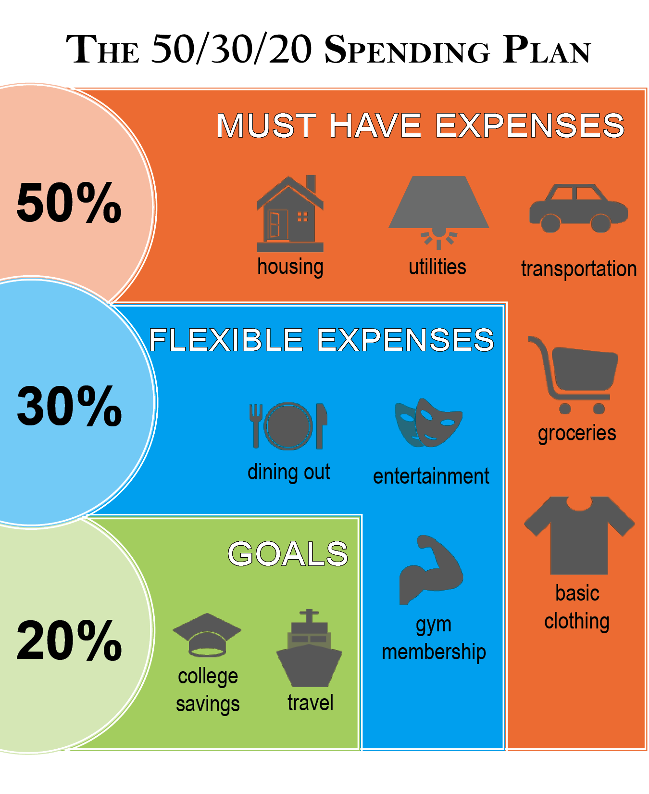

# Budgeting

[numbeo - Numbeo is the world’s largest cost of living database.](https://www.numbeo.com/cost-of-living/)

## Average Americans

- average household's monthly expenses
  - $5,577 per mo
  - $66,928 per year

## Budget Allocation

| Expense Category | Target Percentage | Details |
| ---|---|--- |
| Housing | 34% | |
| Food | 6% | **groceries** $438   **eating out** $253 |
| Healthcare | 5% | anywhere from $309 to $831 per month on health insurance plans, the median cost in America is $541/month |
| Debt Repayment & Savings | 20% |  |
| Utilities | 10% | **Utility Bills**: water, electric, internet, Cell Phone |
| Clothing & Entertainment | 10% | **Fashion**: average U.S. household spends $146 per month on clothing   **Monthly Subscriptions**: Americans spend close to $220 per month on subscription fees |
| Transportation | 10% | **Transportation, & Car Loan, Car Insurance**: costs more than many realize ($913 per month), largely due to the intermittent nature of these expenses. |
| Personal Expenses | 5% |  |

## Average Spending By Age

Average monthly spending by age, 2021

| Age group | Average monthly spending |
| ---|--- |
| Under 25 years | $3,505 |
| 25-34 years | $5,325 |
| 35-44 years | $6,643 |
| 45-54 years | $6,988 |
| 55-64 years | $5,881 |
| 65 years and older | $4,345 |
| 65-74 years | $4,703 |
| 75 years and older | $3,818 |
| All consumers | $5,577 |

## 50/30/20 Rule

This budgeting strategy, popularized by Sen. Elizabeth Warren in her book [_All Your Worth: The Ultimate Lifetime Money Plan_](https://www.simonandschuster.com/books/All-Your-Worth/Elizabeth-Warren/9780743269889 "‌") hinges on funneling your after-tax income to three main categories: 50% on needs, 30% on wants, and 20% to savings or paying off debt.

In this paradigm, half your income is allocated to essentials such as rent, mortgage payments, groceries, utilities, and gas. Thirty percent goes towards things like entertainment, self-care, restaurants, shopping, the gym, or vacations. And 20% is funneled into savings, retirement, investment, or debt payments. We’ve written [here about creating a detailed 50/30/20 budget](https://lifehacker.com/how-to-set-up-a-50-20-30-budget-1843889336 "‌").

As a simpler alternative, some [recommend simplifying this to an “80/20" rule](https://www.johnhancock.com/ideas-insights/debunking-50-30-20-budgeting-rule.html "‌") that automatically withdraws 20% of your paycheck and funnels it into savings, leaving you free to do what you want with the remaining 80%. (This only works if you’re reliable in taking care of all your essential expenditures before spending on entertainment.)

## risk-averse personal wealth strategy

primary goal is to minimize risk and prioritize capital preservation, then focus on stability and security with some potential for growth.

**Emergency Fund:**

- Build a healthy emergency fund to cover unexpected expenses like car repairs or medical bills. Aim for 3-6 months of living expenses in a highly liquid savings account. This acts as a buffer and prevents you from needing to tap into your investments during emergencies.

**High-Yield Savings Accounts:**

- Park a portion of your money in high-yield savings accounts. These accounts offer a slightly higher interest rate than traditional savings accounts, while still maintaining easy access to your money.

**Certificates of Deposit (CDs):**

- Consider investing a portion of your savings in CDs. CDs offer a fixed interest rate for a predetermined period, typically ranging from a few months to several years. The longer the term, the higher the interest rate you'll typically receive. However, your money will be locked in for the duration of the CD.

**Series I Savings Bonds:**

- Explore Series I Savings Bonds from the US government. These bonds offer a competitive interest rate that adjusts for inflation, protecting your purchasing power. They come with limitations on how much you can invest each year and some early withdrawal penalties.

**Investment-Grade Bonds:**

- If you're comfortable with a little more risk, consider investment-grade bonds. These bonds are issued by governments or corporations with high credit ratings, making them less likely to default. However, they also offer lower potential returns compared to stocks.

**Diversification is Key:**

- Even within these low-risk options, diversify your holdings. Spread your money across different accounts and maturities to mitigate risk further.

**Professional Guidance:**

- Consulting with a financial advisor specializing in risk-averse strategies can be beneficial. They can help you create a personalized plan based on your specific circumstances and risk tolerance.

**Remember:**

- This strategy prioritizes safety over high returns. You may experience lower growth compared to aggressive investment approaches.
- Inflation can erode the purchasing power of your money over time. Consider a small allocation to inflation-protected assets like TIPS (Treasury Inflation-Protected Securities) to hedge against inflation.

### Your recurring payments may include:

#### Home Utilities

- Electricity
- Natural Gas
- Water

#### Communication Services

- Internet/Wi-Fi
- Mobile phone plans
- Cable or satellite TV

#### Subscription Streaming Plans

- Television/movie services
- Gaming services
- Radio/music services

#### Memberships

- Fitness/gym
- Wholesale clubs
- Car insurance

## personal consumption expenditures (PCE)

Annualized core PCE refers to the **yearly growth rate** of the **Personal Consumption Expenditures Price Index (core PCE)**.

Here's a breakdown of the terms:

- **Personal Consumption Expenditures (PCE):** This is a measure of how much money people in the United States spend on goods and services. It's basically a way to track consumer spending habits.
- **Price Index:** This takes a basket of typical goods and services and tracks how their prices change over time. It reflects inflation, or the rising cost of living.
- **Core PCE:** This is the PCE price index, but it **excludes food and energy prices**. These categories can be volatile and have big swings that can obscure the underlying trend of inflation. By taking them out, economists get a clearer picture of price changes for other goods and services.
- **Annualized:** This means the growth rate is expressed as a yearly percentage. So, an annualized core PCE of 3% would mean that core PCE prices are rising at a rate of 3% per year.

**Why is annualized core PCE important?**

- It's the **Federal Reserve's preferred measure of inflation**. The Fed uses this data to set monetary policy, which can impact interest rates and the overall health of the economy.
- It helps economists understand how consumer spending is affecting inflation. Rising core PCE can signal that inflation is picking up, while a decline might suggest inflation is slowing.

If you'd like to learn more about core PCE data, you can check out the following resources:

- U.S. Bureau of Economic Analysis: Personal Consumption Expenditures Price Index, Excluding Food and Energy: [https://www.bea.gov/data/personal-consumption-expenditures-price-index-excluding-food-and-energy](https://www.bea.gov/data/personal-consumption-expenditures-price-index-excluding-food-and-energy "‌")
- Investopedia: Personal Consumption Expenditures (PCE): What It Is and Measurement: [https://www.investopedia.com/terms/p/pce.asp](https://www.investopedia.com/terms/p/pce.asp "smartCard-inline")
