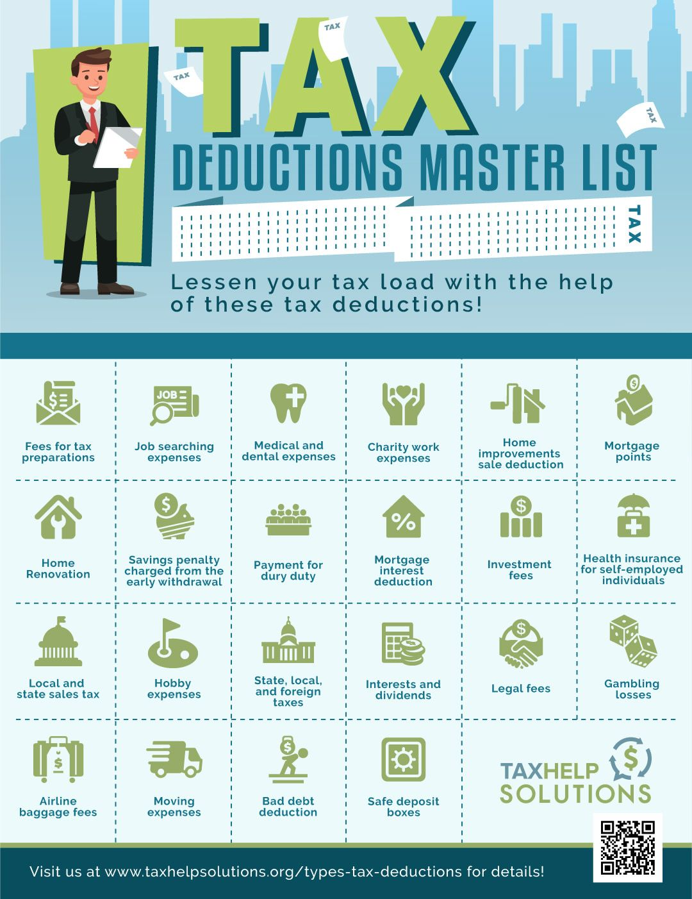

# Standard Deduction

- must forego std deduction for business itemized deductions
- $19,000 must give up your standard deduction

## Mortgage

interest paid on mortgage is tax deductible when you forego the standard deduction

- interest paid on mortgage is tax deductible
- a house could be an asset or a liability
