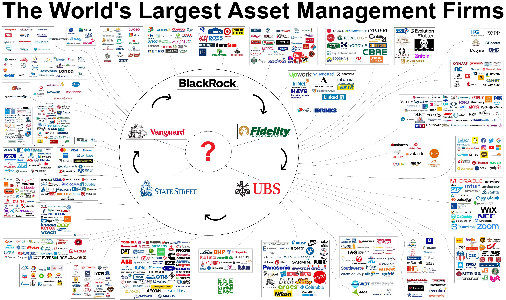

## investment strategies.

- real wealth is earned from making a living
- speculation doesn't earn wealth, speculation transfers wealth based on greed and fear

- **Stock Market**: Invest wisely in stocks, ETFs, or mutual funds. Think of the stock market as a vast, mysterious forest where fortunes can be made if you learn the paths.

- **Alternative Investments**: Look into things like venture capital, commodities, or even art if you fancy. Diversifying is like having different types of armor for different battles.

## Bogleheads

Named after Vanguard Group founder John Bogle, this strategy advocates for saving at least 20% of your income, investing early and often, never trying to “time the market,” finding a risk profile that is not too high _or_ too low, investing in broadly diversified low-cost (low expense ratio) index funds, and staying the course through the stock market’s ups and downs (i.e., not selling the minute you smell a bear market).

In his speech “[Investing with Simplicity](http://johncbogle.com/wordpress/wp-content/uploads/2019/08/Investing-with-Simplicity-1-30-99.pdf "‌")” Bogle said, “Simplicity is the master key to financial success.” Rather than doing extensive research on and tracking of individual stocks, advocate achieving portfolio diversification by following a simple investing philosophy: the creation of a three-fund “lazy” portfolio that includes a total stock market index fund, a total international stock index fund, and a total bond market fund (a percentage that Bogle recommends should be equivalent to your age—if you’re 40, allocate 40% of your portfolio to bonds). Then, outside of periodic rebalancing, set it, forget it, and watch your money produce returns with the market over time.

## Asset Classes

Asset classes are groupings of investments that share similar characteristics and behave in a similar way in the market. They are a way to categorize investments and help investors diversify their portfolios. Here are the major asset classes:

- **Equities (Stocks):** These represent ownership shares in publicly traded companies. When you buy a stock, you're buying a piece of the company and hoping that its value will increase over time. Stocks offer the potential for high returns, but they also come with a higher degree of risk.
  ‌
- **Fixed Income (Bonds):** Bonds are essentially loans that you make to an entity, such as a corporation or government. When you buy a bond, you're essentially lending money to the issuer in exchange for a fixed interest rate over a set period. Bonds are generally considered to be less risky than stocks, but they also offer lower potential returns.
  ‌
- **Cash Equivalents:** These are highly liquid investments that can be easily converted to cash with little or no loss in value. Examples of cash equivalents include money market accounts, certificates of deposit (CDs), and Treasury bills. Cash equivalents offer low returns, but they are a good option for investors who need easy access to their money.

- **Alternative Investments:** Alternative investments are a broad category that includes investments that don't fall into the traditional categories of stocks, bonds, cash equivalents, or real estate. Examples of alternative investments include hedge funds, private equity, and venture capital. Alternative investments can offer the potential for high returns, but they are also generally illiquid and come with a higher degree of risk.

These are just the major asset classes. There are many other sub-asset classes, and new asset classes are emerging all the time. When choosing an asset allocation for your portfolio, it's important to consider your investment goals, risk tolerance, and time horizon.

## active vs passive asset allocation

### PASSIVE ASSET ALLOCATION

“set it and forget it” approach?

#### What is passive asset allocation?

Investors normally subscribe to the efficient market hypothesis and prefer index
funds with low turnover. The main goal is to minimize fees over the long term.

### ACTIVE ASSET ALLOCATION

#### What is active asset allocation?

#### Investors wanting to earn higher returns in comparison to a benchmark.

Quantitative analysis is used and often those involved are said to use a
"contrarian" approach.

## What is GROWTH VS. VALUE INVESTING

Approaches in either stock or mutual fund investing. Growth investors look for companies with strong earnings. Value investors look for companies that are undervalued. Both approaches can help diversify and balance a portfolio.

### Which one has better performance?

## Investment Growth Assessment

