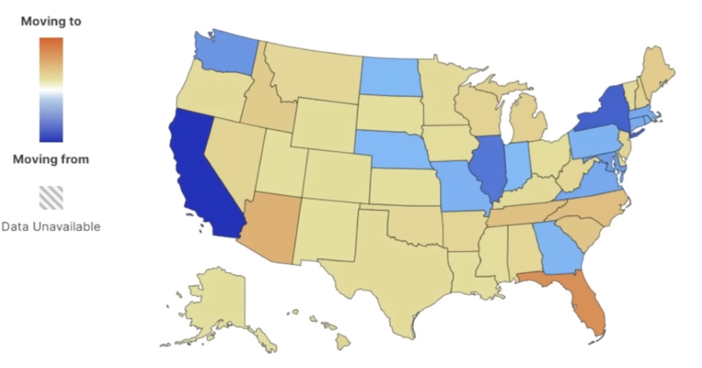

# Locations

## Flood Zone

### Flood Risk

- fema website
- [FloodSmart](https://floodsmart.gov)

N.J.S.A. 46:8-50

property's flood zone, base flood elevation (BFE), Design Flood Elevation (DFE)

- [https://dep.nj.gov/flooddisclosure/](https://dep.nj.gov/flooddisclosure/)
- [https://riskfactor.com/](https://riskfactor.com/)

NJ Flood Disclosure Law (NEW)
Effective March 20th, 2024, landlords and sellers are required to disclose flood risks to buyers and tenants. Sellers must disclose flood risk information, including FEMA flood zones and their knowledge of property flood risks, before a purchase contract is finalized. Landlords must inform prospective renters about FEMA flood zones and share their knowledge of any flooding history in rental premises or associated areas like parking spaces.

## NYC

## HDI

The Human Development Index (HDI) is a summary measure of human development that considers three dimensions: health, education, and standard of living. 

